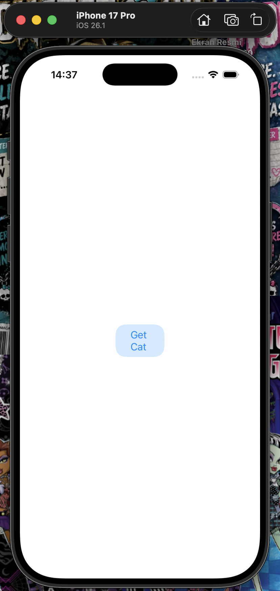
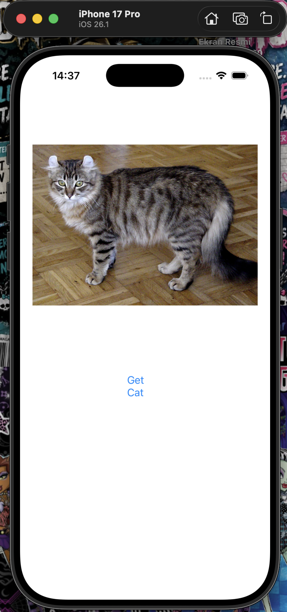
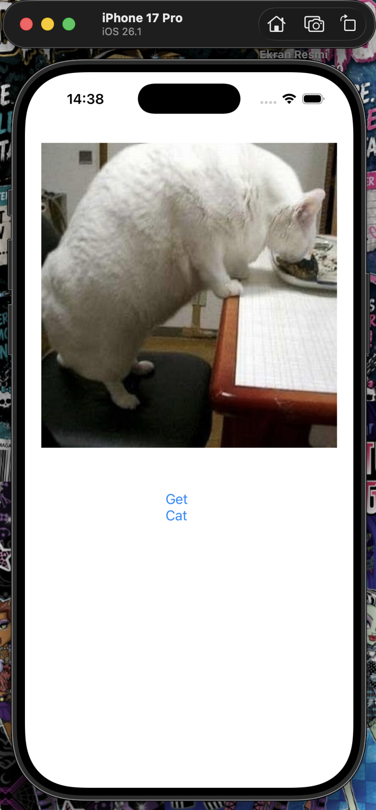

#  CatGalleryApp

A stylish iOS application built with Swift and UIKit that dynamically fetches and displays random cat photos using **TheCatAPI** and **Alamofire**. 

---

##  Screenshots

| Initial View | Fetched Cat Photo | Random Cat Update |
|:------------:|:-----------------:|:-----------------:|
|  |  |  |

---

##  Features

* **Singleton Architecture:** Centralized API networking powered by `NetworkManager.shared`.
* **Secure API Key Handling:** Reads sensitive authentication tokens safely from local `Secrets.plist` files using `Bundle` and `NSDictionary`.
* **Asynchronous Image Loading:** Sequential REST requests via Alamofire to parse image metadata and fetch high-res image data smoothly.
* **Result Type Completion:** Modern Swift `Result<UIImage, Error>` pattern for clean, thread-safe asynchronous completion handlers.

---

##  Tech Stack & Tools

* **Language:** Swift
* **UI Framework:** UIKit (Storyboards / Interface Builder)
* **Networking Framework:** Alamofire
* **Data Processing:** `JSONDecoder` (`Codable`), `UIImage` Data Conversions
* **API:** TheCatAPI (HTTP Headers with API Key authentication)

---

##  Installation & Setup

1. **Clone the repository:**
   ```bash
   git clone [https://github.com/MelikeS28/CatGalleryApp.git](https://github.com/MelikeS28/CatGalleryApp.git)
